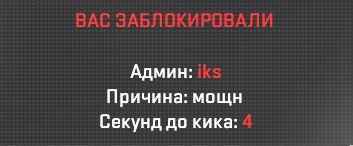
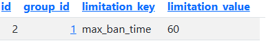
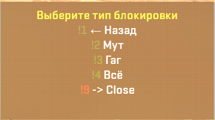
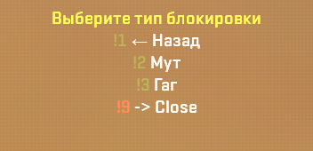
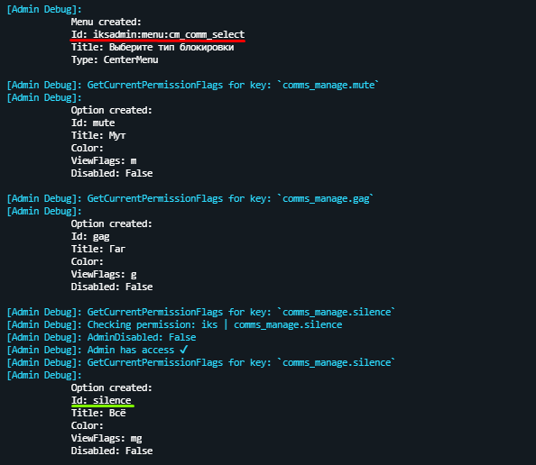

# IksAdmin 3.0
# Навигация
- [Команды](https://github.com/Iksix/Iks_Admin/tree/master?tab=readme-ov-file#%D0%BA%D0%BE%D0%BC%D0%B0%D0%BD%D0%B4%D1%8B)
    - [Основное](https://github.com/Iksix/Iks_Admin/tree/master?tab=readme-ov-file#%D0%BE%D1%81%D0%BD%D0%BE%D0%B2%D0%BD%D0%BE%D0%B5)
    - [Управление блокировками](https://github.com/Iksix/Iks_Admin/tree/master?tab=readme-ov-file#%D1%83%D0%BF%D1%80%D0%B0%D0%B2%D0%BB%D0%B5%D0%BD%D0%B8%D0%B5-%D0%B1%D0%BB%D0%BE%D0%BA%D0%B8%D1%80%D0%BE%D0%B2%D0%BA%D0%B0%D0%BC%D0%B8-blocks_manage)
    - [Управление блокировками чата](https://github.com/Iksix/Iks_Admin/tree/master?tab=readme-ov-file#%D1%83%D0%BF%D1%80%D0%B0%D0%B2%D0%BB%D0%B5%D0%BD%D0%B8%D0%B5-%D0%B1%D0%BB%D0%BE%D0%BA%D0%B8%D1%80%D0%BE%D0%B2%D0%BA%D0%B0%D0%BC%D0%B8-%D1%87%D0%B0%D1%82%D0%B0-comms_manage)
    - [Управление серверами](https://github.com/Iksix/Iks_Admin/tree/master?tab=readme-ov-file#%D1%83%D0%BF%D1%80%D0%B0%D0%B2%D0%BB%D0%B5%D0%BD%D0%B8%D0%B5-%D1%81%D0%B5%D1%80%D0%B2%D0%B5%D1%80%D0%B0%D0%BC%D0%B8-servers_manage)
    - [Управление игроками](https://github.com/Iksix/Iks_Admin/tree/master?tab=readme-ov-file#%D1%83%D0%BF%D1%80%D0%B0%D0%B2%D0%BB%D0%B5%D0%BD%D0%B8%D0%B5-%D0%B8%D0%B3%D1%80%D0%BE%D0%BA%D0%B0%D0%BC%D0%B8-players_manage)
    - [Управление админами](https://github.com/Iksix/Iks_Admin/tree/master?tab=readme-ov-file#%D1%83%D0%BF%D1%80%D0%B0%D0%B2%D0%BB%D0%B5%D0%BD%D0%B8%D0%B5-%D0%B8%D0%B3%D1%80%D0%BE%D0%BA%D0%B0%D0%BC%D0%B8-players_manage)
- [Ограничения групп]()
- [Сортировка/настройка пунктов меню]()
---
# Особенности
- Взаймодействие серверов через RCON команды, и возможность отправлять ркон команды между серверами
Например вы создали новый сервер, настроили и запустили его, он отправит команду обновления данных всем серверам в базе `iks_servers` => Уже запущенные сервера узнают у существовании нового
То же самое если вы допустим выдаёте варн админу на одном сервере => об этом узнают все сервера, и если в это время админ был на другом сервере, то у него всё равно обновятся варны
- Вывод причины кика/бана игроку после выдачи наказания

- Возможность переназначения прав
- Возможность переназначения команд
- Поддержка Menu Manager
- Автоматическое получение ника игрока из Steam при выдаче оффлайн наказаний, если указан `WebApiKey` в конфиге
- Возможность создания групп прав
- Ограничения админа в снятии наказаний [_Общие права снятия наказаний_]()
---
# Команды
- В кавычках категории написана - `группа прав`
- В кавычках команды написано - `право`
- Команды с пометкой `(оффлайн)` - так же работают и на онлайн игрока
- Команды с пометкой `(онлайн)` - не работают на оффлайн игрока
- В `<>` указан флаг доступа по умолчанию
- В `[]` указаны необязательные параметры, их можно не писать
- `">*"` - означает что команда доступна с любыми из зарегестрированых прав
### Общие права снятия наказаний
- Возможность снять наказание выданное админом ниже по иммунитету `"blocks_manage.remove_immunity"` `<i>`
- Возможность снять наказание выданное кем угодно кроме консоли `"blocks_manage.remove_all"` `<u>`
- Возможность снять наказание выданное консолью `"blocks_manage.remove_console"` `<i>`
### Общие права выдачи наказаний
- Возможность указывать свою причину бана `"blocks_manage.own_ban_reason"` `<b>`
- Возможность указывать своё время бана `"blocks_manage.own_ban_time"` `<b>`
- Возможность указывать свою причину мута `"comms_manage.own_mute_reason"` `<m>`
- Возможность указывать своё время мута `"comms_manage.own_mute_time"` `<m>`
- Возможность указывать свою причину гага `"comms_manage.own_gag_reason"` `<g>`
- Возможность указывать своё время гага `"comms_manage.own_gag_time"` `<g>`
- Возможность указывать свою причину silence(а) `"comms_manage.own_silence_reason"` `<g>`
- Возможность указывать своё время silence(а) `"comms_manage.own_silence_time"` `<g>`
### Основное
- `css_admin` - Открыть админ меню `">*"`
- `css_hide` - Скрывает админа в табе `"other.hide"` `<b>`
- `css_reload_infractions <SteamID/IP(WITHOUT PORT)>` - Перезагрузить данные игрока `"other.reload_infractions"` `<z>`
### Управление блокировками `"blocks_manage"`
- #### Выдача бана
    - `css_ban <#uid/#steamId/name/@...> <time> <reason>` - Забанить игрока `(онлайн)` `"ban"` `<b>`
    - `css_addban <steamId> <time> <reason>` - Забанить игрока по SteamID `(оффлайн)` `"ban"` `<b>`
    если при бане по айпи игрок будет на сервере, то он будет забанен и по SteamID тоже
    - `css_banip <#uid/#steamId/name/@...> <time> <reason>` - Забанить по айпи `(онлайн)`  `"ban_ip"` `<b>`
    - `css_addbanip <ip> <time> <reason>` - Забанить по айпи `(оффлайн)` `"ban_ip"` `<b>`
- #### Снятие бана
    - `css_unban <steamId> <reason>` - Разбанить игрока по SteamID `"unban"` `<b>`
    - `css_unbanip <ip> <reason>` - Разбанить игрока по IP `"unban_ip"` `<b>`
### Управление блокировками чата `"comms_manage"`
- #### Выдача наказания
    - `css_gag <#uid/#steamId/name/@...> <time> <reason>` - Выдать гаг игроку `(онлайн)` `gag` `<g>`
    - `css_addgag <steamId> <time> <reason>` - Выдать гаг игроку `(оффлайн)` `gag` `<g>`
    - `css_mute <#uid/#steamId/name/@...> <time> <reason>` - Выдать гаг игроку `(онлайн)` `mute` `<m>`
    - `css_addmute <steamId> <time> <reason>` - Выдать мут игроку `(оффлайн)` `mute` `<m>`
    - `css_silence <#uid/#steamId/name/@...> <time> <reason>` - Выдать silence игроку `(онлайн)` `silence` `<mg>`
    - `css_addsilence <steamId> <time> <reason>` - Выдать silence игроку `(оффлайн)` `silence` `<mg>`
- #### Снятие наказания
    - `css_ungag <#uid/#steamId/name/@...> <reason>` - Снять гаг с игрока `(онлайн)` `"ungag"` `<g>`
    - `css_removegag <steamId> <reason>` - Снять гаг с игрока `(оффлайн)` `"ungag"` `<g>`
    - `css_unmute <#uid/#steamId/name/@...> <reason>` - Снять мут с игрока `(онлайн)` `"unmute"` `<m>`
    - `css_removemute <steamId> <reason>` - Снять мут с игрока `(оффлайн)` `"unmute"` `<m>`
    - `css_unsilence <#uid/#steamId/name/@...> <reason>` - Снять silence с игрока `(онлайн)` `"unsilence"` `<mg>`
    - `css_removesilence <steamId> <reason>` - Снять silence с игрока `(оффлайн)` `"unsilence"` `<mg>`
### Управление серверами `"servers_manage"`
- `css_am_reload [all]` - перезагружает данные с БД, если all - то на всех серверах `"reload_data"` `<z>`
- `css_am_servers` - Выводит список всех серверов `"list"` `<z>`
- `css_rcon <ServerID> <CMD>` - Отправить ркон команду на сервер (можно узнать прописав `css_am_servers`) `"rcon"` `<z>`
- `css_rban <steamId(admin)> <steamId(target)> <ip/-> <time> <type(0/1/2)> <reason> <announce(true/false)>` - Выполнить бан от имени администратора `"rcon"` `<z>`
- `css_rcomm <steamId(admin)> <steamId(target)> <ip/-> <time> <type(0/1/2)> <reason> <announce(true/false)>` - Выполнить бан чата от имени администратора `"rcon"` `<z>`

### Управление игроками `"players_manage"`
- `css_kick <#uid/#steamId/name/@...> <reason>` - Кикнуть игрока `"kick"` `<k>`
- Возможность вводить свою причину кика - `"kick_own_reason"` `<k>`
- `css_respawn <#uid/#steamId/name/@...>` - Возродить игрока `"respawn"` `<k>`
- `css_slay <#uid/#steamId/name/@...>` - Убить игрока `"slay"` `<k>`
- `css_changeteam <#uid/#steamId/name/@...> <ct/t/spec>` - Сменить команду игрока(с убийством) `"changeteam"` `<k>`
- `css_switchteam <#uid/#steamId/name/@...> <ct/t/spec>` - Сменить команду игрока(без убийства) `"changeteam"` `<k>`
- `css_who <#uid/#steamId/name/@...>` - Кикнуть игрока `"kick"` `<b>`

### Управление админами `"admins_manage"`
- #### Добавление/удаление/редактирование админов
    - `css_am_add <steamId> <name> <time/0> <server_id/this> <groupName>` - Создать админа `"add"` `<z>`
    - `css_am_add <steamId> <name> <time/0> <server_id/this> <flags> <immunity>` - Создать админа `"add"` `<z>`
    - `css_am_add_server_id <AdminID> <server_id/this>` - Добавить ServerID админу `"add"` `<z>`
    - `css_am_remove <id>` - Удалить админа `"delete"` `<z>`
    - `css_am_list [all]` - Выводит список админов сервера, если all - то всех `"list"`
- #### Управление варнами
    - `css_am_warn <SteamID> <time> <reason>` - Выдать варн админу `"warn_add"` `<z>`
    - `css_am_warns <Admin ID>` - Выводит все активные варны админа `"warn_list"` `<z>`
    - `css_am_warn_remove <Warn ID>` - Удалить варн `"warn_delete"` `<z>`
---
# Ограничения групп, groups_limitations
Плагин предоставляет функционал ограничения админ прав по группам.
Ограничения хранятся в таблице iks_groups_limitations.
Запись с ограничением выглядит так:

(Запись выше запрещает группе c id `1` банить на время более чем `60` минут)
- `group_id` - айди группы которую нужно ограничить
- `limitation_key` - ключ по которому будет происходить ограничение
- `limitation_value` - значение ограничения 
### Доступные ограничения:
список будет пополнятся...
- `min_<ban/gag/mute>_time` - минимальное время выдачи наказаний
- `max_<ban/gag/mute>_time` - максимальное время выдачи наказаний
- `max_<bans/gags/mutes>_in_day` - максимальное кол-во наказаний за 24 часа
---
# Сортировка/настройка пунктов меню
В версии 3.0 был добавлен функционал сортировки и настройки меню
Он позволяет: 
- Менять пункты местами 
- Устанавливать специальные флаги отображения для определённых пунктов в меню
- Включать/выключать пункт в меню
- ВАЖНО!!! Это работает только с меню созданными через API админки

Настройки хранятся в файле `sortmenus.json`
Пример:
```json
"iksadmin:menu:testmenu" : [ // ID Меню
    {
        "Id" : "iksadmin:option:1", // ID пункта
        "ViewFlags" : "not override", // Флаги с которыми пункт отображается в меню (not override - определяет плагин)
        "View" : true // Отображать ли пункт в меню вообще
    }
]
```
Допустим я хочу убрать из меню возможность заблокировать сразу оба чата

Для этого:
```json
"iksadmin:menu:cm_comm_select" : [ // Я пишу ID этого меню
    {
        "Id" : "silence", // Прописываю ID пункта в этом меню
        "View" : false // Выключаю отображение пункта в меню
    }
]
```
После добавления настройки в `sortmenus.json` получаем:

### Как узнать ID меню и пунктов?
Для этого нужно включить `DebugMode` в конфиге плагина `core.json`
После этого при открытии меню будут отображаться данные о нём:
 
- Красным цветом подчёркнуто - ID меню
- Зелёным - ID пункта
После настройки выключаем `DebugMode` потому что он очень много спамит в консоль :)
---