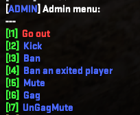
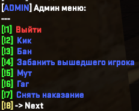

## Iks_Admin EN
Support the author: <a href="https://www.donationalerts.com/r/iks__">DonationAlerts</a>  
Admin system with menu  

## Commands

- `css_admin` - Open the admin menu | Flags are not needed
- 
- `css_ban #uid/#sid/username duration reason <name if needed>` - Ban a player | Flag: `b`
- `css_banip #uid/#sid/username/ip(offline only) duration reason <name if needed>` - Ban the game by IP | Flag: `b`
- `css_unban sid/ip` - Unban the player | Flag: `u`
- `css_mute #uid/#sid/username duration reason <name if needed>` - Mute a player | Flag: `m`
- `css_unmute #uid/#sid/username` - Unmute a player | Flag: `m`
- `css_gag #uid/#sid/username duration reason <name if needed>` - Give a gag to the player | Flag: `g`
- `css_ungag #uid/#sid/username` - Ungag the player | Flag: `g`
- `css_kick #uid/#sid/username reason` - Kick the player | Flag: `k`
- 
- `css_adminadd <sid> <name> <flags/-> <immunity> <group_id> <endtime> <server_id/-> (FOR ALL SERVER)>` - Add admin | Flag: `z`
- `group_id` = -1 => No group
- `immunity` = -1 => Immunity from group
- `flags` = - => Flags from group
- `server_id` = - => All servers
- `endtime` - Time to end admin 
- 
- `css_admindel <sid>` - Delete admin | Flag: `z`
- `css_reload_admins` - Reload admins | Flag: `z`
- `css_reload_admins_cfg` - Reload plugin cfg | Flag: `z`
## Rcon comands
- `css_rban <sid> <ip/-(Auto)> <adminsid/CONSOLE> <duration> <reason> <BanType (0 - default / 1 - ip> <name if needed>`
- `css_runban <sid> <adminsid/CONSOLE>`
-
- `css_rgag <sid> <adminsid/CONSOLE> <duration> <reason> <name if needed>`
- `css_rungag <sid> <adminsid/CONSOLE>`
-
- `css_rmute <sid> <adminsid/CONSOLE> <duration> <reason> <name if needed`
- `css_runmute <sid> <adminsid/CONSOLE>`

## Settings
- Configure the database `cfg`
- Change the Server Id to the desired one `cfg`
- Configure the reasons `cfg`
- Set up translations `lang/en.json`
- You can convert flags from the plugin to CSSharp flags `cfg - "ConvertedFlags"`

## Flags:
- `z` - All rights
- `b` - Ban
- `k` - Kick
- `m` - Mute
- `g` - Gag
- `u` - Unban
- `s` - css_slay `In the future..`
- `t` - switch/change team `In the future..`

## To Do
- Log to discord
- `css_slay` - In menu
- `css_switchteam` - In menu
- `css_rename <uid> <name>` - In menu
- `css_changeteam` - In menu
- `css_csay uid/@all/@ct/@t time "message"` - Print To Center
- `css_hsay uid/@all/@ct/@t time "message"` - Print To CenterHtml
- Commands for open menus
- Converting from Iks_Admin flags to CSS +
- WebSite
## Required
- [CSSharp v161](https://github.com/roflmuffin/CounterStrikeSharp/releases/tag/v161)

## Iks_Admin RU
Поддержать автора: <a href="https://www.donationalerts.com/r/iks__">DonationAlerts</a>  
Админ система с меню  

## Команды

- `css_admin` - Открыть админ меню | Флаги не нужны
- 
- `css_ban #uid/#sid/username duration reason <name if needed>` - Забанить игрока | Флаг: `b`
- `css_banip #uid/#sid/username/ip(offline only) duration reason <name if needed>` - Забанить игрока по айпи | Флаг: `b`
- `css_unban sid/ip` - Разбанить игрока | Флаг: `u`
- `css_mute #uid/#sid/username duration reason <name if needed>` - Замутить игрока | Флаг: `m`
- `css_unmute #uid/#sid/username` - Размутить игрока | Флаг: `m`
- `css_gag #uid/#sid/username duration reason <name if needed>` - Дать гаг игроку | Флаг: `g`
- `css_ungag #uid/#sid/username` - Снять гаг с игрока | Флаг: `g`
- `css_kick #uid/#sid/username reason` - Кикнуть игрока | Флаг: `k`
- 
- `css_adminadd <sid> <name> <flags/-> <immunity> <group_id> <endtime> <server_id/-> (ДЛЯ ВСЕХ СЕРВЕРОВ)>` - Добавить админа | Флаг: `z`
- `group_id` = -1 => Нет группы
- `immunity` = -1 => Иммунитет из группы
- `flags` = - => Флаги из группы
- `server_id` = - => Все сервера
- `endtime` - Время до конца админки
- 
- `css_admindel <sid>` - Удалить админа | Флаг: `z`
- `css_reload_admins` - Перезагрузить админов | Флаг: `z`
- `css_reload_admins_cfg` - Перезагрузить конфиг | Флаг: `z`
## Ркон команды
- `css_rban <sid> <ip/-(Auto)> <adminsid/CONSOLE> <duration> <reason> <BanType (0 - default / 1 - ip> <name if needed>`
- `css_runban <sid> <adminsid/CONSOLE>`
-
- `css_rgag <sid> <adminsid/CONSOLE> <duration> <reason> <name if needed>`
- `css_rungag <sid> <adminsid/CONSOLE>`
-
- `css_rmute <sid> <adminsid/CONSOLE> <duration> <reason> <name if needed`
- `css_runmute <sid> <adminsid/CONSOLE>`
- Команда проеряет может ли админ выполнить её

## Настройка
- Настройте базу данных `cfg`
- Поменяйте ServerId на нужный `cfg`
- Настройте причины `cfg`
- Настройте переводы `lang/en.json`
- Вы можете конвертировать флаги из плагина в CSSharp флаги `cfg - "ConvertedFlags"`

## Флаги:
- `z` - Все права
- `b` - Бан
- `k` - Кик
- `m` - Мут
- `g` - Гаг
- `u` - Разбан
- `s` - css_slay `В планах...`
- `t` - Смена сторон `В планах...`

## Планы
- Лог в дискорд
- `css_slay` - будет в меню
- `css_switchteam` - будет в меню
- `css_changeteam` - будет в меню
- `css_rename <uid> <name>` - In menu
- `css_csay uid/@all/@ct/@t time "message"` - Print To Center
- `css_hsay uid/@all/@ct/@t time "message"` - Print To CenterHtml
- Конвертация из флагов Iks_Admin в CSS +
- Комманды для открытия меню
- Сайт
## Зависимости
- [CSSharp v161](https://github.com/roflmuffin/CounterStrikeSharp/releases/tag/v161)

